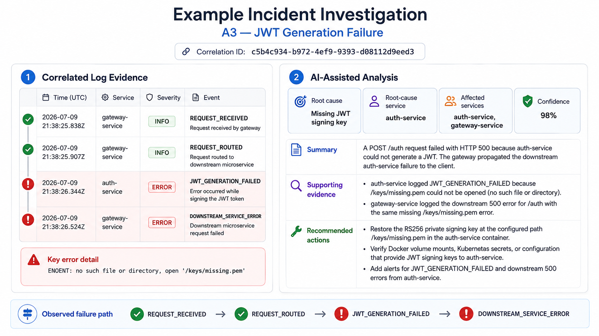

# LLM-Assisted Incident Analysis Platform

A containerized microservice platform for **log-centric operational incident analysis** using structured logging, request correlation, and evidence-constrained LLM assistance.

The platform extends a Node.js media-sharing application with a centralized observability layer. Operational events are correlated across services, stored centrally, and retrieved by correlation ID so that an LLM can generate structured root-cause analysis, supporting evidence, and recommended actions for human review.

> **Design principle:** AI-generated incident analysis should be traceable back to operational evidence.

## Highlights

- Node.js/Express microservice architecture
- Custom API Gateway with RS256 JWT verification
- End-to-end request correlation using correlation IDs
- Centralized structured operational logging
- Dedicated incident-analysis service using the OpenAI Responses API
- Strict structured output for predictable downstream handling
- Human-in-the-loop incident investigation dashboard
- Reproducible operational failure scenarios
- Docker Compose environment with MongoDB and Azurite
- Azure deployment and CI/CD assets retained from the application platform

## Architecture

```text
                         ┌─────────────────────┐
                         │      Frontend       │
                         │       :3000         │
                         └──────────┬──────────┘
                                    │
                                    ▼
                         ┌─────────────────────┐
                         │     API Gateway     │
                         │       :4000         │
                         │                     │
                         │ JWT verification    │
                         │ Correlation ID      │
                         │ Request routing     │
                         └──────────┬──────────┘
                                    │
           ┌────────────┬───────────┼───────────┬────────────┐
           ▼            ▼           ▼           ▼
      ┌─────────┐  ┌─────────┐ ┌─────────┐ ┌─────────┐
      │  Auth   │  │ Comment │ │  Like   │ │  Photo  │
      │ :4001   │  │ :4002   │ │ :4003   │ │ :4004   │
      └────┬────┘  └────┬────┘ └────┬────┘ └────┬────┘
           │            │           │           │
           └────────────┴───────────┴───────────┘
                              │
                    ┌─────────┴─────────┐
                    ▼                   ▼
               ┌─────────┐         ┌─────────┐
               │ MongoDB │         │ Azurite │
               └─────────┘         └─────────┘
                    ▲
                    │ structured logs
                    │
             ┌──────┴───────────┐
             │ Logging Service  │
             │      :4005       │
             └──────┬───────────┘
                    │ correlated evidence
                    ▼
          ┌─────────────────────────┐
          │ Incident Analysis       │
          │ Service :4006           │
          └───────────┬─────────────┘
                      │
                      ▼
               ┌─────────────┐
               │ OpenAI LLM  │
               └──────┬──────┘
                      │ structured analysis
                      ▼
          ┌─────────────────────────┐
          │ Incident Dashboard      │
          │        :3001            │
          └─────────────────────────┘
```

### Incident-analysis flow

```text
Client request
    ↓
API Gateway assigns / propagates correlation ID
    ↓
Request traverses application services
    ↓
Services emit structured operational events
    ↓
Logging Service stores correlated logs
    ↓
Incident Analysis Service retrieves evidence by correlation ID
    ↓
Evidence-constrained prompt is sent to the LLM
    ↓
Structured diagnosis is returned
    ↓
Investigator reviews the analysis and supporting evidence
```

The LLM is used as a **decision-support component**, not as an autonomous remediation system.

## Services

| Component | Responsibility | Port |
|---|---|---:|
| Frontend | Server-rendered application UI | `3000` |
| Incident Dashboard | Log inspection and incident-analysis UI | `3001` |
| API Gateway | Routing, JWT verification, auth enforcement, correlation-ID propagation | `4000` |
| Auth Service | User authentication and RS256 JWT issuance | `4001` |
| Comment Service | Comment operations | `4002` |
| Like Service | Like/unlike operations | `4003` |
| Photo Service | File validation, upload, and blob-storage integration | `4004` |
| Logging Service | Central ingestion and retrieval of structured logs | `4005` |
| Incident Analysis Service | Correlated-log retrieval and LLM-assisted analysis | `4006` |
| MongoDB | Application data and operational log persistence | `27017` |
| Azurite | Local Azure Blob Storage emulation | `10000` |

## Structured Logging

Services emit normalized operational events containing fields such as:

```json
{
  "timestamp": "2026-08-01T10:32:15.112Z",
  "service": "photo-service",
  "severity": "ERROR",
  "event": "OPERATION_TIMEOUT",
  "correlationId": "cf5982a2-26d8-4f95-...",
  "message": "Photo upload operation timed out",
  "metadata": {
    "operation": "blob-upload"
  }
}
```

| Field | Purpose |
|---|---|
| `timestamp` | When the event occurred |
| `service` | Service that emitted the event |
| `severity` | `INFO`, `WARN`, or `ERROR` |
| `event` | Standardized machine-readable event name |
| `correlationId` | Links events belonging to the same request |
| `message` | Human-readable description |
| `metadata` | Additional structured context |

Correlation IDs allow an investigation to reconstruct a request across service boundaries instead of relying on timestamps alone.

## LLM-Assisted Analysis

The Incident Analysis Service retrieves the logs associated with a supplied correlation ID and sends only that evidence to the configured model.

The response is constrained to a structured format containing fields including:

```json
{
  "confidence": 95,
  "affectedServices": ["photo-service"],
  "rootCauseService": "photo-service",
  "summary": "Photo upload failed while interacting with storage.",
  "rootCause": "Storage operation timeout",
  "supportingEvidence": [
    "PHOTO_UPLOAD_STARTED was recorded for the request.",
    "OPERATION_TIMEOUT was later recorded for the same correlation ID."
  ],
  "recommendations": [
    "Verify storage availability and connectivity.",
    "Review timeout thresholds and dependency latency."
  ]
}
```

The service is designed to:

1. ground conclusions in retrieved operational evidence;
2. return predictable structured output for the dashboard;
3. surface supporting evidence alongside the diagnosis; and
4. keep final operational judgement with the investigator.

Model-generated confidence is treated as an indicator rather than a calibrated probability.

## Example Incident Investigation

The example below shows a controlled JWT-generation failure. Events from the
gateway and authentication service are linked by the same correlation ID,
allowing the analysis service to reconstruct the failure path and generate an
evidence-backed diagnosis.



**Observed failure path:**  
`REQUEST_RECEIVED` → `REQUEST_ROUTED` → `JWT_GENERATION_FAILED` → `DOWNSTREAM_SERVICE_ERROR`

The analysis identifies `auth-service` as the root-cause service and traces the
failure to the missing RS256 signing key referenced in the operational logs.

## API Endpoints

### Logging Service — `http://localhost:4005/api/v1`

| Method | Endpoint | Purpose |
|---|---|---|
| `POST` | `/logs` | Store a structured log event |
| `GET` | `/logs` | Retrieve logs |
| `GET` | `/logs/search` | Search stored logs |
| `GET` | `/logs/:correlationId` | Retrieve logs for one correlation ID |

### Incident Analysis Service — `http://localhost:4006/api/v1`

| Method | Endpoint | Purpose |
|---|---|---|
| `POST` | `/analysis` | Analyse an incident using its correlation ID |

Example request:

```json
{
  "correlationId": "cf5982a2-26d8-4f95-..."
}
```

The application-facing Auth, Comment, Like, and Photo routes continue to be exposed through the API Gateway.

## Validation Scenarios

The platform includes **11 reproducible operational failure scenarios** covering authentication, database access, service exceptions, storage failures, and input validation.

| ID | Scenario |
|---|---|
| `A1` | Unknown username |
| `A2` | Invalid password |
| `A3` | JWT generation failure |
| `D1` | Authentication database failure |
| `D2` | Photo database failure |
| `D3` | Comment database failure |
| `D4` | Like database failure |
| `C1` | Service exception |
| `T1` | Blob upload timeout |
| `S1` | Azurite/storage dependency failure |
| `V1` | Unsupported file type |

Across these controlled scenarios, the analysis pipeline scored **52/55 (94.5%) against a predefined incident-analysis rubric** covering affected-service identification, root-cause identification, supporting evidence, and recommendations.

This result applies to the controlled scenario set and should not be interpreted as general-purpose LLM accuracy.

## Technology Stack

| Layer | Technology |
|---|---|
| Runtime | Node.js |
| Backend | Express.js |
| Frontend templating | Pug |
| Authentication | JWT with RS256 asymmetric signing |
| Application database | MongoDB / Azure Cosmos DB MongoDB API |
| Operational log store | MongoDB |
| Local blob storage | Azurite |
| Cloud blob storage | Azure Blob Storage |
| LLM integration | OpenAI Responses API |
| Containerisation | Docker |
| Local orchestration | Docker Compose |
| Cloud deployment assets | Azure Container Apps |
| CI/CD | Azure DevOps + Docker Hub |
| Cloud monitoring assets | Azure Application Insights / Log Analytics |

## Engineering Decisions

### Correlation at the API boundary

The Gateway creates or propagates a correlation ID before forwarding requests. Downstream services include the same identifier in their structured events, providing a deterministic way to reconstruct an incident across service boundaries.

### Centralized structured logging

Operational events are sent to a dedicated Logging Service instead of being treated as isolated console output. Standard fields make the evidence searchable, machine-readable, and suitable for automated analysis.

### Evidence-constrained LLM use

The model receives correlated logs rather than unrestricted application context. Structured output makes the result easier to validate, display, and consume programmatically.

### Human-in-the-loop operation

The platform generates diagnostic support and recommendations but does not automatically remediate incidents. This keeps operational decisions with the investigator.

### RS256 authentication

The Auth Service holds the private signing key while other components can verify tokens using the public key. This avoids distributing a shared JWT signing secret.

### Local reproducibility

MongoDB and Azurite allow the full application and incident-analysis workflow to be reproduced with Docker Compose without requiring live Azure infrastructure.

## Repository Structure

```text
llm-incident-analysis-platform/
├── frontend/
├── gateway/
├── incident-dashboard/
├── services/
│   ├── auth-service/
│   ├── comment-service/
│   ├── like-service/
│   ├── photo-service/
│   ├── logging-service/
│   └── incident-analysis-service/
├── docs/
│   ├── events.md
│   └── incident-corpus.md
├── assets/
│   └── screenshots/
├── mongodb-backup/
├── docker-compose.yml
├── azure-pipelines.yml
└── README.md
```

> Internal development notes are intentionally excluded from the published documentation.

## Local Setup

### Prerequisites

- Docker / Docker Desktop
- OpenSSL
- An OpenAI API key for live LLM analysis

### 1. Clone the repository

```bash
git clone https://github.com/ktasie/llm-incident-analysis-platform.git
cd llm-incident-analysis-platform
```

### 2. Generate JWT keys

```bash
openssl genpkey -algorithm RSA -out jwt_rsa -pkeyopt rsa_keygen_bits:2048
openssl rsa -pubout -in jwt_rsa -out jwt_rsa.pub
```

Create a root-level `keys/` directory and place both files inside it:

```text
keys/
├── jwt_rsa
└── jwt_rsa.pub
```

> Never commit the private `jwt_rsa` key.

### 3. Configure environment files

Each component provides an `.env.example`. Create the corresponding `.env.docker` files required by `docker-compose.yml` and set the necessary values.

The Incident Analysis Service expects configuration including:

```env
NODE_ENV=development
PORT=4006
LOGGING_SERVICE=http://logging-service:4005
OPENAI_API_KEY=your-api-key
OPENAI_MODEL=gpt-5.5
OPENAI_TEMPERATURE=0
MAX_LOGS=40
MOCK_OPENAI=false
```

Do not commit API keys, connection strings, or private JWT material.

### 4. Start the stack

```bash
docker compose up --build
```

Main local endpoints:

| Component | URL |
|---|---|
| Application | `http://localhost:3000` |
| Incident Dashboard | `http://localhost:3001` |
| API Gateway | `http://localhost:4000` |
| Logging Service | `http://localhost:4005` |
| Incident Analysis Service | `http://localhost:4006` |

### 5. Seed local users

```bash
docker compose exec auth-service node seed-users.js
```

### 6. Stop the stack

```bash
docker compose down
```

Use `docker compose down -v` if you also want to remove persistent MongoDB and Azurite volumes.

## Screenshots

A small number of screenshots is more useful here than a long gallery.

### Application


### Cloud deployment


## Cloud Deployment Assets

The repository retains deployment assets from the Azure-hosted application architecture:

- Azure Container Apps
- Azure Cosmos DB
- Azure Blob Storage
- Azure Application Insights / Log Analytics
- Azure DevOps
- Docker Hub

The full logging and LLM-assisted incident-analysis workflow is reproduced locally through Docker Compose.

## CI/CD

`azure-pipelines.yml` contains the Azure DevOps pipeline used to build container images, publish them to Docker Hub, and update Azure Container Apps.

```text
Git push
   ↓
Azure DevOps
   ↓
Docker build
   ↓
Docker Hub
   ↓
Azure Container Apps
```

## Current Limitations

| Area | Current implementation | Possible extension |
|---|---|---|
| Evidence | Centralized logs | Add traces and metrics |
| Incident complexity | Controlled single-fault scenarios | Concurrent and multi-causal failures |
| LLM evaluation | One configured model | Multi-model comparison and calibration |
| Orchestration | Docker Compose | Kubernetes or managed orchestration |
| Remediation | Human decision-making | Approval-gated remediation workflows |
| Testing | Prototype-focused | Broader unit, integration, contract, and fault-injection coverage |

## Author

**Kelechukwu Tasie**

GitHub: [@ktasie](https://github.com/ktasie)
